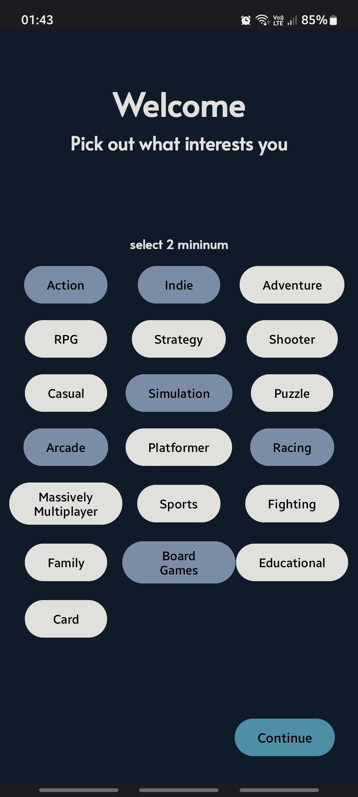
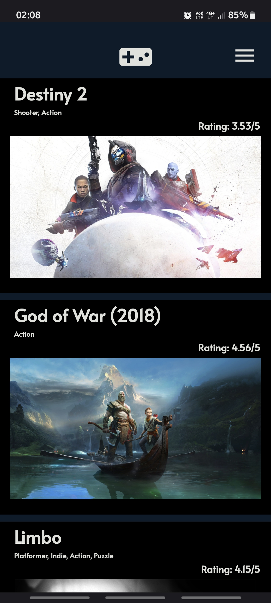
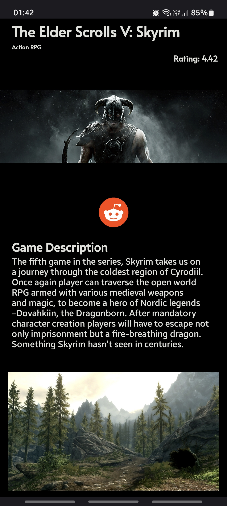

This is a project android app made in kotlin using jetpack navigation component. 
App description: 
Onboarding screen that lets the user select genres he is interested in 
● Genre selection is saved locally using room database  
● A screen with the list of games from the selected genres appear 
● Tapping on a single game opens a news screen with a bit more info about the game 
● User is able to change his genre selection in the settings that in return, refreshes the screen with the list of
games 
**Screenshots** 

 
To make understanding the code better, I adhered to the MVVM (Model-View-ViewModel) architecture while building this project.  
For this project, I chose to use Room database instead of Firebase.  While Firebase is well-suited for projects requiring an online database, Room was a much more appropriate choice for this use case due to its local storage capabilities.  

Running the code 
in "presentation/ui/fragments/GameInfoFragment" change YOUR_API with the real api from [RAWG.io](RAWG.io) 
in "presentation/ui/fragments/GamesFragment" change YOUR_API with the real api from [RAWG.io](RAWG.io) 
in "presentation/ui/fragments/OnboardingFragment" change YOUR_API with the real api from [RAWG.io](RAWG.io) 
